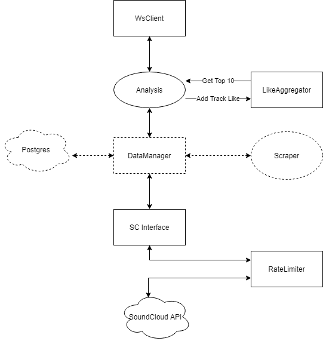

Here's a personal project that I "rebooted" this summer. I attached a quick diagram of the architecture, and you'll find the entrypoint to the bulk of the logic in src/analysis/index

It's a web app that takes in your favorite SoundCloud track and recommends other SoundCloud tracks. It's a relatively simple process that looks at the favoriters of the inputted track, aggregates their likes, and returns the most commonly seen tracks in that aggregation. It's still in its infancy, but it's a project that I've worked on that has a number of classes that have their special responsibilities and relationships which I had to put some thought into.

Some major features I haven't implemented but modeled the architecture to support is caching all API calls to a Postgres database and to constantly scraping SoundCloud's API in the background. It actually provides recommendations that I think is better than SoundCloud's recommendations!

